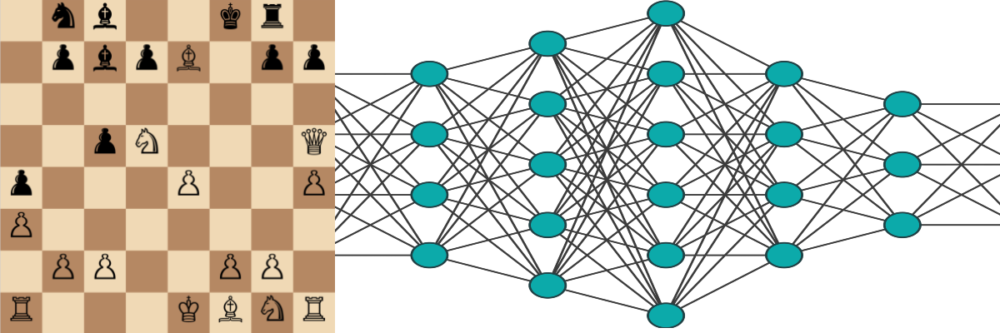

# Chess Net

A simple value/policy headed Neural Network trained using supervised learning; intended for use during agent searches and/or as the basis of a reinforcement learning agent.

This simple Neural Network serves a small part in my BSc Hons dissertation project for agent evaluation.

### Running the model

If you do not want to train your own model or processe the data the project contains the nessecary files to run the model, due to the hardware demand associated with training the model.

1. Simply call the `test_saved_model` function in `src/main.py`
2. Execute `python src/main.py`

### Training and Testing the model

If you intend to train the model it is highly recommended to do so on a GPU, training roughly took 4 hours on a M1 chip Mac compared to 15 mintues on a RTX 2060 for about 7 epochs of training each.

1. To ensure the data is properly formated for the Neural Network run `python src/processing.py`
2. To create and train a model call the `train_test_run` function, or load a model call the `test_saved_model` function in `src/main.py`
3. Execute selected model behaviour run `python src/main.py`

all saved models are found in `models/*.pth`

## Datasets

This model was trained off the [Lichess Dataset](https://www.kaggle.com/datasets/datasnaek/chess) from kaggle, consisting of just over 20,000 games of chess. This can be found within the project at `datasets/raw/games.csv`

The processed dataset is saved as `datasets/processed/chess_dataset.npz`
